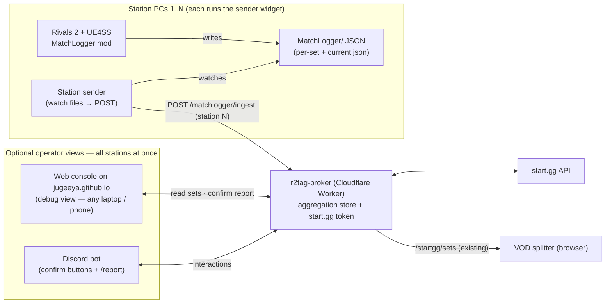

# MatchLogger ↔ start.gg ↔ VOD splitter — integration design

This document describes how to connect the Rivals of Aether II **MatchLogger**
UE4SS mod (`ue4ss/Mods/MatchLogger/`) to a live tournament: knowing which
station a machine is, pinging when a set ends, optionally reporting the set to
start.gg, and feeding precise timings to the [VOD splitter](../vods/). Every
piece lives in this repo — the mod and per-station sender under `matchlogger/`,
the optional web console as a page here, and the broker endpoints in
[`../broker/worker.js`](../broker/worker.js).

## The core idea

Everything in the existing toolchain already joins on the same two coordinates:
**station number + wall-clock time**. The VOD splitter fetches sets from the
broker as `{ id, startedAt, completedAt, station, fullRoundText,
players:[{name, character}] }` and computes each clip as `startedAt −
recordingStart − pad`, filtered by station. start.gg is the source of
*identity* (who, which station, which round); the MatchLogger is the source of
*precise timing + characters + stats*. Tying them together just means giving
the MatchLogger the same two coordinates the rest of the system uses.

| Source          | Authoritative for                                          |
| --------------- | ---------------------------------------------------------- |
| **start.gg**    | set id, station, the two entrants, bracket round           |
| **MatchLogger** | frame-accurate set/match start & end, per-game characters, full stats (KOs, damage, parries, …) |
| **Join key**    | station + time window                                      |

## Components

At a real event every station needs to report, but nobody needs a dedicated
admin machine. So **every station PC runs the sender** (usually as the corner
widget, which is where its station number gets set), the broker is the
**aggregation hub**, and the operator administrates the bracket on **start.gg
itself**. The hosted web console and Discord are **optional views** on the
broker's aggregated state — a debug console for checking what the pipeline is
doing, and one-click confirms for reporting — not something the event depends
on.



The design keeps four concerns strictly separated:

- **The mod stays dumb and tournament-agnostic.** It writes JSON to disk and
  nothing else — no networking, no secrets, no station awareness. The same
  install works at any station.
- **The station sender is set-and-forget.** A tiny per-station background
  process that watches the MatchLogger folder and POSTs finished sets to the
  broker with its station number — this is what lets every station run with
  nobody sitting at it. Its station number is its only per-machine config,
  usually set through the corner widget (the same sender with a small
  always-on-top status window); the headless `station_sender.py` is the
  no-window variant.
- **The broker is the aggregation hub and holds the secrets.** It stores every
  ingested set per event (keyed by station + time), does the start.gg matching,
  and drives Discord. Note the current broker (`../broker/worker.js`) reads
  start.gg through its *unauthenticated website API* (`www.start.gg/api/-/gql`)
  — perfect for the read-only matching/lookup here, but a bracket **write**
  (`reportBracketSet`) needs authenticated access it does not yet have. See
  "Reporting to start.gg needs write access" below.
- **The operator surfaces are optional.** The bracket itself is administrated
  on start.gg, as at any event. Two interchangeable views read the broker's
  aggregated state when a human wants eyes on the pipeline: a **hosted web
  console** (effectively a debug view — is every station sending? did the set
  match?) and **Discord**. Ambiguous decisions (confirm a winner, fix an
  entrant mapping, push a report) happen on one of these — or the operator
  simply enters the result on start.gg directly and ignores them.

This is the same shape as the existing metrics project (mod → files → sender →
cloud) and the VOD splitter (browser → broker → start.gg).

## Data the mod already writes

`FinalizeSet()` in `main.lua` writes one file per set to `MatchLogger/sets/`:

```jsonc
{
  "setId": "20240115_143000",
  "complete": true,
  "startTime": "2024-01-15T14:30:00Z",       // character select entered
  "firstMatchStartTime": "2024-01-15T14:31:12Z",
  "endTime": "2024-01-15T14:43:05Z",
  "durationSeconds": 785,
  "winsRequired": 3,
  "matchCount": 4,
  "winnerSlot": 1, "winnerName": "…", "winnerCharacter": "clairen",
  "players": [ { "slot": 1, "name": "…", "character": "clairen", "wins": 3 }, … ],
  "matches": [ { "index": 1, "startTime": "…", "endTime": "…", "players": [ …full stats… ] }, … ]
}
```

### Mod additions needed

1. **Epoch timestamps.** The set report has ISO strings; the join with
   start.gg (`startedAt`/`completedAt` are epoch seconds) and with the VOD
   splitter is cleanest if the mod also emits `startEpoch` / `endEpoch`
   (`os.time()` is already computed internally). The sender could parse the
   `Z` ISO strings as UTC instead, but explicit epochs are less error-prone.

2. **A live-state file for "now playing".** To drive the UI's live station
   tracking — and, more importantly, to pre-bind entrant identity *before* a
   set ends — the mod overwrites a single `MatchLogger/current.json` at the
   hooks it already has:

   | Hook (existing)                | `current.json` becomes                              |
   | ------------------------------ | --------------------------------------------------- |
   | CharacterSelect → set start    | `{ "state": "set_start", "setId", "startEpoch" }`   |
   | VersusScreen → match start     | `{ "state": "match_start", "setId", "matchIndex" }` |
   | Results → match/set end         | `{ "state": "idle" }` (per-set file already written) |

   This is a small addition riding on hooks already in `main.lua`, and it is
   what makes identity matching reliable (see below).

## The station sender (headless, per station)

A tiny background process on each game PC — Python or Node, or an eventual
small `.exe`. It has no UI and no secrets; its only config is which station it
is (`--station 3`, or a one-line file). It:

- **Watches** `MatchLogger/sets/*.json` (new set) and `current.json` (live
  state).
- **On set start** (`current.json` → `set_start`): POSTs a lightweight
  heartbeat to `/matchlogger/current` so the broker (and thus the console)
  knows station N just started a set — this is what triggers the broker's
  `/startgg/station` pre-binding.
- **On a new set file:** stamps the station and POSTs it to
  `/matchlogger/ingest`, then marks the file consumed (same "clear after
  consume" pattern as the metrics project).

It retries on failure and is otherwise invisible. Every station PC runs one —
in practice as the corner widget (`station_widget.py`), the same sender with a
station-number field and a live status dot.

## The broker as aggregation hub

The broker stores, per event, every ingested set keyed by station + time, plus
the latest `current` heartbeat per station. That aggregated view is what the
console and Discord read, so a human can see all stations without anything
being co-located. Suggested shape (Cloudflare KV/R2/D1):

```jsonc
// GET /matchlogger/event?slug=…  → the operator's whole-event view
{
  "stations": {
    "3": { "current": { "state": "match_start", "setId": "…", "since": 170533… },
           "entrants": [ { "id": "…", "name": "…" }, … ] }   // pre-bound at set start
  },
  "sets": [
    { "id": "…", "station": 3, "ingestedAt": 170533…,
      "modSet": { …character/score/stats… },
      "matchedStartggSetId": "12345678",
      "candidateWinnerEntrantId": "…", "confidence": "high|low|none",
      "status": "recorded | matched | notified | reported | error" }
  ]
}
```

### Endpoints

Existing:

- `GET /startgg/sets?slug=…` → completed sets for the VOD splitter (unchanged).

New:

- `POST /matchlogger/current` → body `{ slug, station, current }`. Records the
  heartbeat; on a `set_start`, looks up `/startgg/station` and caches the
  entrants for pre-binding.
- `GET /startgg/station?slug=…&station=N` → the set called/in progress at
  station N: `{ setId, fullRoundText, state, entrants:[{id, name, seed}] }`.
- `POST /matchlogger/ingest` → body `{ slug, station, set }`. Stores the set,
  matches it (station + time window, using the pre-bound entrants), computes a
  candidate winner + confidence, fires the Discord notification. **Read-only
  with respect to the bracket.**
- `GET /matchlogger/event?slug=…` → the aggregated whole-event view above,
  for the web console (and an SSE variant for live updates).
- `POST /matchlogger/report` → body `{ slug, setId, winnerEntrantId,
  gameData? }`. Calls start.gg's `reportBracketSet` mutation. Invoked from an
  explicit operator action on either surface (or auto, guarded — see below).
  **Requires start.gg write access (see below).**
- `POST /discord/interactions` → Discord's interaction webhook: handles the
  confirm/report buttons and the manual `/report` slash command.

Discord credentials stay server-side in the Worker.

### Reporting to start.gg needs write access

The read endpoints (`/startgg/sets`, `/startgg/station`) work today because
the broker calls start.gg's unauthenticated website API. A bracket *write*
does not — `reportBracketSet` requires authentication. Two options:

- **Official start.gg API token** (developer token, added as a Worker secret).
  Clean and supported, but reporting requires the token's owner to have TO
  permissions on the event.
- **Logged-in session cookie** against the website API. No developer token,
  but fragile (expires, undocumented) — a fallback, not the primary path.

Until write access is wired up, every surface still does the full
notify/aggregate/confirm flow; the final "report" button is just disabled
(or falls back to "mark reported manually").

## Optional view 1 — the web console (a page in this repo)

A static page alongside `../vods/`, sharing `../styles.css` and the broker —
no local server, runs on any laptop or phone. It's the MatchLogger's **debug
view**: the event runs fine without it open, but when you want to check that
every station is sending, that heartbeats are flowing, or why a set didn't
match, this is where you look. It reads `/matchlogger/event` (SSE for live
updates) and shows:

- **Config:** event slug (broker URL is implicit).
- **Stations panel:** one live "now playing" card per station from the
  heartbeats — "Station 3: [A] vs [B] — Winners R2".
- **Sets-today table across all stations:** columns for station, time, players
  (character), score, matched start.gg round, and **status**. Matched rows
  expose **Report**, which opens an inline winner picker (so a wrong/low-confidence
  auto-match can be corrected) and calls `/matchlogger/report` with the
  operator passcode. Reporting is offered only for sets matched to a start.gg
  set; the button is disabled otherwise.

### Reporting is passcode-gated

The start.gg token lives only in the Worker, but a public Worker URL means the
report *action* needs its own gate or anyone could write to the bracket. So the
operator enters a **passcode** (`OPERATOR_KEY` on the Worker, kept in the
browser's sessionStorage) that accompanies every report; the Worker verifies it
(constant-time) before doing anything. The actual bracket write additionally
needs `STARTGG_TOKEN` — so reporting degrades cleanly: no `OPERATOR_KEY` → 503,
wrong passcode → 401, right passcode but no token → 501. See
[`../broker/README.md`](../broker/README.md#why-reporting-is-gated).

## Optional view 2 — Discord

Interchangeable with the web console, and often the more practical one since
TOs already live in Discord:

- **Notify + confirm inline.** On ingest the broker posts a message to a
  configured channel — "Station 3: set complete, 3–1, ~12 min, winner on
  Clairen → likely **[EntrantA]**" — with **Report 3–1** / **Swap winner** /
  **Ignore** buttons. Clicking Report calls the same `/matchlogger/report`
  path. Works from a phone, no software.
- **Manual `/report` slash command.** `/report station:3 score:3-1
  winner:@Player` — a fallback ingestion path for stations *not* running the
  mod, or for corrections. The broker resolves the station's set and writes
  it, so Discord doubles as a lightweight reporting UI for the whole event.

## Identity matching — the hard part, and the rule

To report a score you must map the game-set to a start.gg set **and its
winner**.

- **Which set?** Broker queries the event for the set called at station N near
  the reported time. Station + time window is usually unique — the same
  assumption the VOD splitter and TSH already rely on.
- **Which entrant won?** Fragile: in-game names (Steam/display) do not
  reliably equal start.gg tags, so exact-match is unreliable. The fix is to
  **capture the two entrants at set start** (the sender's
  `/matchlogger/current` heartbeat triggers the broker's `/startgg/station`
  lookup), so by set end the pairing is known and the winner follows from
  side + score.

**Rule: notify + one-click confirm; never silently guess.** The ingest ping
always fires; an actual bracket write happens only when the operator confirms,
or (later) automatically *only* when identity is unambiguous (e.g. in-game
tags matched start.gg tags exactly). Reporting a wrong score to a live bracket
is worse than not reporting, so the system fails toward pinging a human.

## VOD splitter tie-in

start.gg's `startedAt`/`completedAt` are report/call times (loose). The
MatchLogger's are frame-accurate. Two low-cost wins:

- **Timing export:** because the broker already holds every ingested set, it
  can serve a `sets[]` array in the exact shape the splitter consumes (`{
  startedAt, completedAt, station, fullRoundText, players:[{name, character}]
  }`) but with MatchLogger timestamps — tighter clips, auto-named by merging
  start.gg round text with MatchLogger characters. The splitter just points at
  a `/matchlogger/sets` endpoint instead of `/startgg/sets`.
- **Filename station stamp:** putting the station in the OBS recording
  filename (`Station5_2024-01-15 14-30-00.mkv`) lets the mod, the sender, and
  the splitter agree on station with no extra config, and the splitter can
  auto-select the station from the filename it already parses.

## Where each piece lives

Everything is in this one repo (`jugeeya.github.io`):

- **`matchlogger/ue4ss/`** — the UE4SS mod + minimal profile (drop-in install
  for a game PC).
- **`matchlogger/sender/`** — the headless per-station sender ✅ *(built:
  `station_sender.py`, stdlib-only, forwards `sets/*.json` and
  `current.json` to the broker with the station stamped on)*.
- **`matchlogger/` page** (`index.html` + `matchlogger.js/.css`) — the optional
  web console, a static page alongside `../vods/` sharing `../styles.css` ✅
  *(built: live "now playing" per station + a sets-today table; reads
  `/matchlogger/event`; reporting button present but disabled pending write
  access)*.
- **`../broker/worker.js`** — the `/matchlogger/*` (incl. passcode-gated
  `/report`) and `/startgg/station` endpoints + KV aggregation store ✅
  *(built; Discord notify optional via `DISCORD_WEBHOOK_URL`)*. The bracket
  write inside `/report` activates once `STARTGG_TOKEN` is set.
- **`matchlogger/DESIGN.md`** — this document.

## Phasing

- **Phase 0 — sender + console skeleton.** Headless station sender (watch →
  POST) ✅ and the mod's `current.json`/epoch output ✅; still to do: a static
  console page reading a stub `/matchlogger/event` with the aggregated "sets
  today across stations" table.
- **Phase 1 — ingest + Discord notify.** `/matchlogger/ingest` stores sets and
  posts to Discord on set end ✅. Read-only w.r.t. start.gg.
- **Phase 2 — live tracking + confirm-report.** `current.json` mod addition ✅ +
  `/matchlogger/current` heartbeat ✅ + `/startgg/station` pre-binding ✅; real
  names/round in the console ✅; passcode-gated operator **report** action with
  a winner picker ✅ (the bracket write itself activates once `STARTGG_TOKEN` is
  set). Still to do: the Discord `/report` slash command.
- **Phase 3 — guarded auto-report + timing export.** Auto-report only on
  unambiguous identity; `/matchlogger/sets` timing export for the splitter.

## Operational notes

- start.gg write credentials (once added) and Discord credentials live only in
  the broker; the read path uses start.gg's unauthenticated website API.
- Bracket writes default to operator confirmation, on whichever surface.
- Every station PC runs the sender (widget); none of them needs an operator
  sitting at it. A station that isn't running the mod at all can still be
  reported via the Discord `/report` command — or simply on start.gg, as
  always.
- The anti-cheat/offline caveat from the mod README still applies — UE4SS only
  injects when the game runs without Easy Anti-Cheat.
